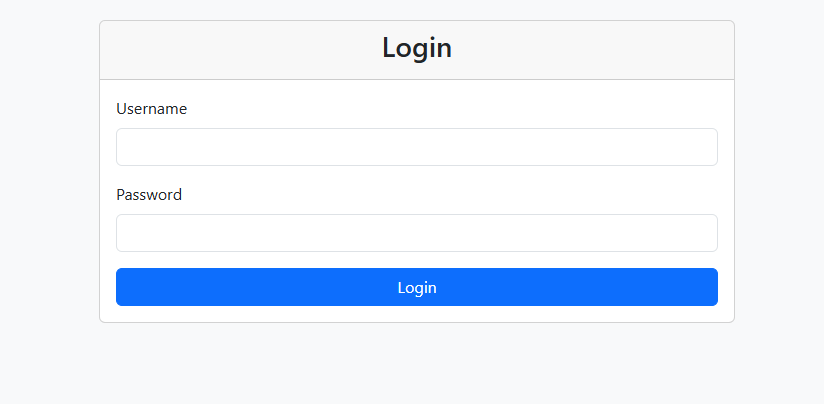
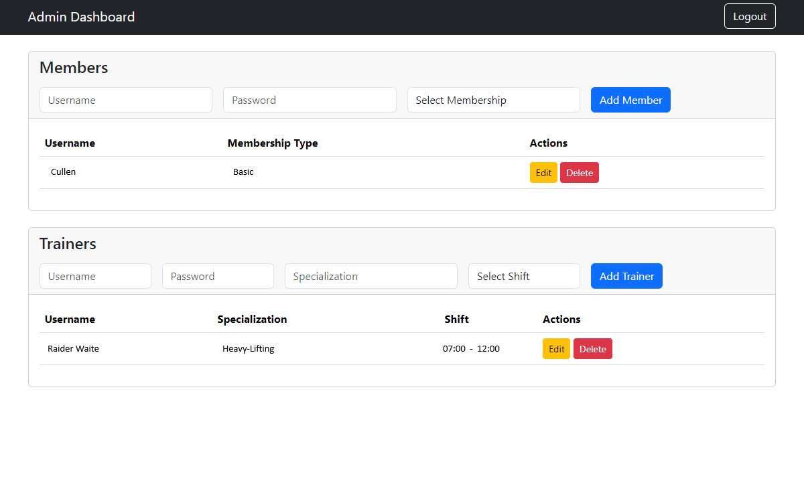
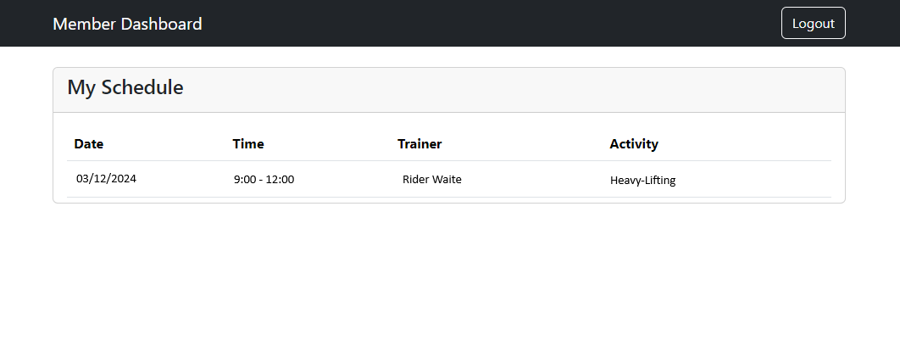
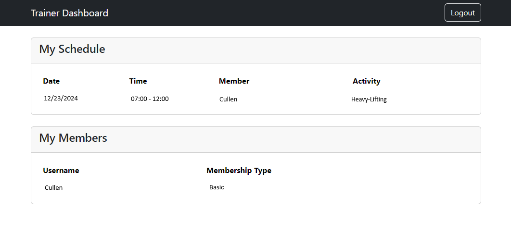

# Fitness Club Management System

## Overview

The Fitness Club Management System is a comprehensive web-based application designed to streamline the management of fitness clubs. Built using Spring Boot, this system provides a robust platform for administrators to manage members and trainers efficiently. It also offers dedicated interfaces for members and trainers to access their schedules and information.

## Technologies Used

- **Spring Boot**: A powerful framework for building Java applications.
- **MySQL**: A relational database management system for storing user data.
- **Thymeleaf**: A modern server-side Java template engine for web applications.
- **Bootstrap 5**: A front-end framework for developing responsive and mobile-first websites.
- **Spring Security**: A powerful and customizable authentication and access control framework.

## Features

**Admin Portal**

The Admin Portal provides a comprehensive dashboard for administrators to manage the fitness club's operations. Key features include:

- **Secure Authentication**: A robust authentication system to ensure secure access.
- **Member Management**: Perform CRUD (Create, Read, Update, Delete) operations on member profiles.
- **Trainer Management**: Manage trainer profiles with CRUD functionalities.
- **Schedule Management**: Create and manage training schedules for members and trainers.

**Member Portal**

The Member Portal allows members to view their personal training schedules and information about their assigned trainers. Features include:

- **Personal Training Schedule**: Members can view their upcoming training sessions.
- **Trainer Information**: Access details about their assigned trainer, including specialization and contact information.

**Trainer Portal**

The Trainer Portal provides trainers with the tools they need to manage their schedules and members. Key features include:

- **Assigned Members List**: Trainers can view a list of members assigned to them.
- **Training Schedule Management**: Access and manage their training schedules efficiently.

## Screenshots

**Login Page**

**Admin Dashboard**

**Member Dashboard**

**Trainer Dashboard**

## Installation

To set up the Fitness Club Management System locally, follow these steps:

Clone the Repository:

git clone https://github.com/yourusername/fitness-club-management-system.git

cd fitness-club-management-system

Set Up the Database:

- Create a new MySQL database.
- Update the application.properties file with your database credentials.

Build the Project:

mvn clean install

Run the Application:

mvn spring-boot:run

Access the Application: Open your web browser and navigate to http://localhost:8080.

## Usage

- **Admin**: Log in with admin credentials to manage members, trainers, and schedules.
- **Member**: Log in to view your training schedule and trainer information.
- **Trainer**: Log in to manage your assigned members and training sessions.

## Contributing

Contributions are welcome! If you would like to contribute to the Fitness Club Management System, please fork the repository and submit a pull request.

## License

This project is licensed under the MIT License - see the LICENSE file for details.
